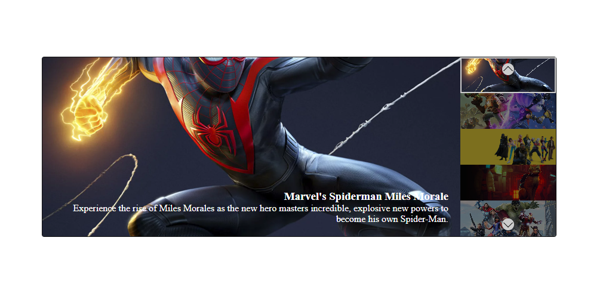

# Carosello Array di Oggetti

### Consegna:
Dato un array di oggetti letterali con:
 - url dell’immagine
 - titolo
 - descrizione
Creare un carosello come nella foto allegata.

###### Milestone 0:
- Creare un array di oggetti: [Url, titolo, descrizione]

###### Milestone 1:
- inserire oggetti letterali nel carosello.
- Evento click utente su frecce verso sinistra o destra, l'immagine è active con titolo e testo (vedi screen allegato).

###### Milestone 2:
- Aggiungere il **ciclo infinito** del carosello. 

###### BONUS 1:
- Aggiungere le thumbnails (sottoforma di miniatura) ed al click attivare l’immagine corrispondente.

###### BONUS 2:
- Aggiungere funzionalità di autoplay: dopo un certo periodo di tempo (3 secondi) l’immagine attiva dovrà cambiare alla successiva.

###### BONUS 3:
- Aggiungere bottoni di start/stop e di inversione del meccanismo di autoplay.